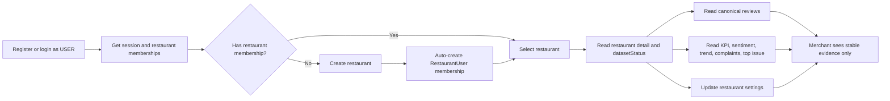
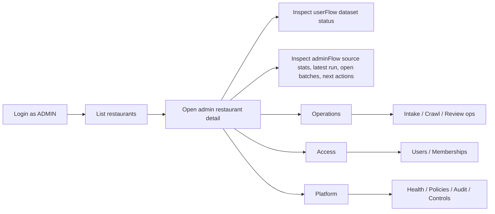
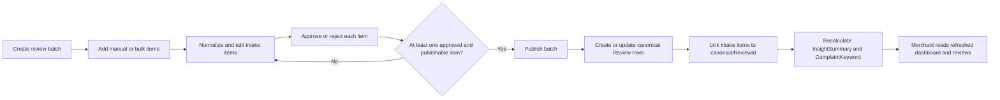
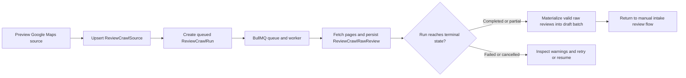

# Sentify Backend Business Flow Map

Updated: 2026-03-26

This document explains the backend business model exactly as it exists today, with the actor split, domain boundaries, and the fine-grained events that are still only implicit in code.

## 1. Product Meaning

Sentify is not primarily a crawler product.
It is a merchant intelligence product with an admin-operated evidence pipeline.

The current backend contract is:

- `USER` is the merchant-facing actor
- `ADMIN` is the internal control-plane actor
- merchant routes read only canonical, published data
- admin routes own intake, crawl, publish, access, and platform controls
- publish is the only boundary that makes evidence merchant-visible

That means the real business promise is:

- merchants read stable restaurant intelligence
- admins curate and operate the machinery behind that intelligence

## 2. Business Domain Map

### Core actors

- `User`
  - `USER`: merchant-facing account
  - `ADMIN`: internal operator account
- `RestaurantUser`
  - restaurant scope only
  - no owner / manager / member sub-roles

### Merchant-visible canonical layer

- `Restaurant`
- `Review`
- `InsightSummary`
- `ComplaintKeyword`

This is the only layer the merchant product should treat as product truth.

### Admin-only staging and runtime layer

- `ReviewIntakeBatch`
- `ReviewIntakeItem`
- `ReviewCrawlSource`
- `ReviewCrawlRun`
- `ReviewCrawlRawReview`
- `PlatformControl`

This is the operator layer that prepares, curates, and governs the canonical layer.

## 3. Merchant Flow

### Business interpretation

The merchant does not ingest data.
The merchant authenticates, lands inside the restaurant space they belong to, and reads the currently published intelligence for that restaurant.

If no restaurant exists yet, the merchant can create one, which also creates their membership immediately.

### Flow diagram

### What the merchant is actually allowed to do

- authenticate
- get session plus memberships
- create a restaurant
- list restaurants they belong to
- read restaurant detail and dataset status
- read canonical review evidence
- read dashboard aggregates
- update restaurant profile fields

### What the merchant is intentionally blocked from

- draft intake items
- raw crawl evidence
- publish operations
- platform controls
- admin account management

## 4. Admin Flow

### Business interpretation

The admin is the operator of the evidence pipeline.
Admin work starts from restaurant discovery, then branches into:

- operations
  - intake
  - crawl
  - review ops
- access
  - users
  - memberships
- platform
  - health
  - policy visibility
  - runtime controls
  - audit feed

### Admin shell flow

## 5. Admin Operations Flow

### Manual intake flow

### Crawl-assisted flow

### Review ops flow

`review-ops` exists to compress the crawl-to-draft path into one operator workflow:

1. sync Google Maps URL to draft
2. inspect source and run state
3. inspect batch readiness
4. bulk-approve valid pending items
5. publish

This lets the frontend call one opinionated operator surface instead of stitching low-level crawl APIs itself.

## 6. Access And Platform Flow

### Access domain

The access surface is not a directory-only feature.
It is the account-governance boundary.

Current admin actions:

- create `USER` or `ADMIN`
- change user role
- lock, unlock, deactivate, reactivate
- trigger password reset
- create or delete restaurant memberships

Important invariants:

- admins cannot demote themselves
- admins cannot lock or deactivate themselves
- the last available `ADMIN` cannot be locked, deactivated, or downgraded
- `ADMIN` accounts cannot hold restaurant memberships
- deactivated `USER` accounts cannot receive restaurant membership assignment

### Platform domain

The platform surface is the runtime-governance boundary.

Current admin capabilities:

- inspect API, database, queue, and worker posture
- inspect integrations and policy truth
- inspect synthetic audit feed
- toggle runtime controls:
  - `crawlQueueWritesEnabled`
  - `crawlMaterializationEnabled`
  - `intakePublishEnabled`

## 7. State Machines That Matter

### Account state

- `ACTIVE`
- `LOCKED`
- `DEACTIVATED`

This state is derived from user lifecycle fields, not from a dedicated enum column.

### Intake batch state

- `DRAFT`
- `IN_REVIEW`
- `READY_TO_PUBLISH`
- `PUBLISHED`
- `ARCHIVED`

Important nuance:

- current code actively uses `DRAFT`, `IN_REVIEW`, `READY_TO_PUBLISH`, and `PUBLISHED`
- `ARCHIVED` exists in the enum but is not currently exposed as an active route-driven workflow

### Intake item state

- `PENDING`
- `APPROVED`
- `REJECTED`

Important nuance:

- publish does not introduce a separate item-level `PUBLISHED` approval state
- publish is currently inferred by `canonicalReviewId` being populated

### Crawl source state

- `ACTIVE`
- `DISABLED`

### Crawl run state

- `QUEUED`
- `RUNNING`
- `PARTIAL`
- `COMPLETED`
- `FAILED`
- `CANCELLED`

## 8. Missing Fine-Grained Events And Modeling Gaps

These gaps are not all bugs.
They are the missing micro-events or explicit workflow markers that would make the backend more complete, more auditable, and easier to extend safely.

| Gap | Why it matters | Recommended explicit event or model |
| --- | --- | --- |
| No explicit restaurant onboarding state | Merchant can create a restaurant, but there is no first-class state for "created but not operationally ready" | Add `restaurantOperationalState` or explicit onboarding events such as `RESTAURANT_CREATED`, `RESTAURANT_READY_FOR_DATA`, `FIRST_DATASET_PUBLISHED` |
| Intake item review has no reviewer identity or review timestamp | `approvalStatus` and `reviewerNote` exist, but actor/time are missing | Add `reviewedByUserId`, `reviewedAt`, and optional item-level review event history |
| Batch review lifecycle is mostly derived, not recorded | Batch status changes are useful, but there is no history of who moved a batch into review or to ready state | Add batch transition events such as `INTAKE_BATCH_REVIEW_STARTED`, `INTAKE_BATCH_READY`, `INTAKE_BATCH_REOPENED` |
| Publish actor is missing from the batch record | `publishedAt` exists, but `publishedByUserId` does not | Add `publishedByUserId` on `ReviewIntakeBatch` or a dedicated publish event table |
| Canonical review lineage is one-way only | Intake items can point to canonical reviews, but canonical reviews do not carry durable provenance back to intake item or raw crawl review | Add publish lineage records such as `ReviewPublishEvent` or `reviewLineage` table |
| Audit feed is synthesized, not event-sourced | The current platform audit feed is useful for visibility, but it cannot guarantee historical actor-accurate replay | Add a durable audit event table for access, membership, intake, crawl, publish, and control changes |
| Crawl source enable/disable is stateful but weakly historical | Source state is visible now, but not preserved as explicit operator history | Add source lifecycle events such as `CRAWL_SOURCE_ENABLED`, `CRAWL_SOURCE_DISABLED`, `CRAWL_SOURCE_RECONFIGURED` |
| Platform control history is shallow | Singleton control state stores `updatedByUserId`, but not full change history | Add platform-control change events with before/after payloads |
| Merchant `Actions` has no backend task domain yet | Merchant top issue exists, but there is no first-class action/task entity that powers follow-through | Add an optional task/action domain only if `/app/actions` should become operational rather than informational |
| `ARCHIVED` batch state is not operationalized | The enum exists, but there is no complete archive workflow | Either implement archive endpoints and rules or remove the enum state until needed |

## 9. Known Documentation Drift

Current drift worth remembering:

- `DATABASE.md` still describes the schema as 13 models, but the live Prisma schema has 14 models because `PlatformControl` now exists
- some `DATABASE.md` crawl-field descriptions still reflect older field naming and should be verified against `prisma/schema.prisma`

When the question is "what is true right now?", prefer:

1. `prisma/schema.prisma`
2. this document
3. `CURRENT-STATE.md`
4. `API.md`

## 10. Fast Path For Future Sessions

If the next session needs to continue backend/domain work, read in this order:

1. `backend-sentify/docs/BUSINESS-FLOW-MAP.md`
2. `backend-sentify/docs/CURRENT-STATE.md`
3. `backend-sentify/prisma/schema.prisma`
4. `backend-sentify/docs/API.md`
5. `backend-sentify/docs/PROJECT-STATUS.md`
