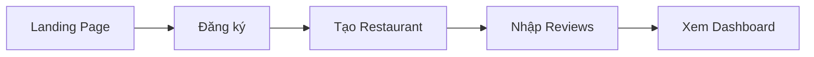
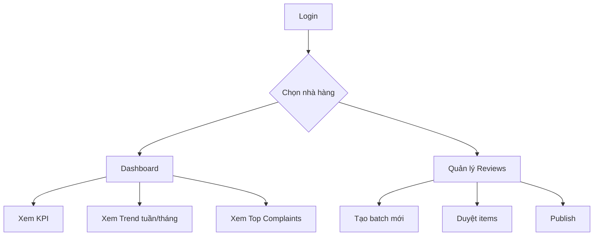
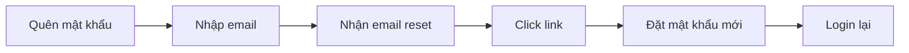

# 🎯 Sentify MVP — User Flow & Feature Map

> Tài liệu này mô tả luồng sử dụng MVP từ góc nhìn **người dùng cuối**.
> Mục đích: giúp team FE, BE, QA cùng hiểu rõ sản phẩm trước khi triển khai.
>
> **Last updated**: 2026-03-16 (Sprint 2 complete)

---

## Tổng quan sản phẩm

**Sentify** là nền tảng quản lý và phân tích đánh giá (review) cho nhà hàng. Hệ thống giúp chủ nhà hàng:

1. **Thu thập** đánh giá từ nhiều nguồn (nhập thủ công, paste, CSV)
2. **Phân tích** cảm xúc tự động (tích cực / trung tính / tiêu cực) + trích xuất từ khóa phàn nàn
3. **Theo dõi** xu hướng đánh giá, chỉ số KPI qua dashboard trực quan

---

## Actors (Vai trò)

| Actor | Mô tả | Quyền |
|---|---|---|
| **Guest** | Chưa đăng ký | Xem landing page, đăng ký, đăng nhập |
| **Owner** | Chủ nhà hàng (tạo restaurant) | Toàn quyền: CRUD restaurant, team, reviews, dashboard |
| **Manager** | Thành viên được mời | Xem dashboard, quản lý reviews (không xoá restaurant, không mời người) |

---

## User Journeys

### Journey 1: Onboarding (Lần đầu sử dụng)



| Bước | Endpoint | Mô tả |
|---|---|---|
| 1. Đăng ký | `POST /api/auth/register` | Email + password + fullName → access token + refresh token |
| 2. Tạo restaurant | `POST /api/restaurants` | Nhập tên → auto-generate slug → trở thành OWNER |
| 3. Tạo batch reviews | `POST /api/admin/review-batches` | Chọn nhà hàng → tạo batch (DRAFT) |
| 4. Thêm reviews | `POST .../items/bulk` | Nhập hàng loạt: tên, rating, nội dung, ngày |
| 5. Duyệt & publish | `POST .../publish` | Auto-analyze sentiment → sinh canonical reviews → tính insight |
| 6. Xem dashboard | `GET .../dashboard/kpi` | KPI, sentiment %, trend, complaints, top-issue |

---

### Journey 2: Quản lý hằng ngày



| Hành động | Endpoint | Chi tiết |
|---|---|---|
| Đăng nhập | `POST /api/auth/login` | Trả access + refresh token |
| Refresh session | `POST /api/auth/refresh` | Tự động khi token hết hạn (15 phút) |
| Xem restaurants | `GET /api/restaurants` | List tất cả nhà hàng user có quyền |
| Dashboard KPI | `GET .../dashboard/kpi` | totalReviews, averageRating |
| Sentiment % | `GET .../dashboard/sentiment` | POSITIVE / NEUTRAL / NEGATIVE % |
| Xu hướng | `GET .../dashboard/trend?period=week` | Rating trung bình + số reviews theo tuần/tháng |
| Từ khoá phàn nàn | `GET .../dashboard/complaints` | Top keywords kèm count + % |
| Vấn đề nổi bật | `GET .../dashboard/top-issue` | Keyword có tần suất cao nhất |

---

### Journey 3: Khôi phục tài khoản



| Bước | Endpoint | Bảo mật |
|---|---|---|
| Yêu cầu reset | `POST /api/auth/forgot-password` | Luôn trả success (chống email enumeration) |
| Đặt lại mật khẩu | `POST /api/auth/reset-password` | Token hashed, single-use, hết hạn 30 phút |

---

## Sơ đồ Data Flow MVP

```
┌─────────────┐       ┌─────────────┐       ┌──────────────────┐
│   Frontend  │──────▶│   REST API  │──────▶│    PostgreSQL    │
│  (Vue/React)│◀──────│  (Express)  │◀──────│    (Prisma ORM)  │
└─────────────┘       └──────┬──────┘       └──────────────────┘
                             │
               ┌─────────────┼──────────────────┐
               │             │                  │
        ┌──────▼──────┐ ┌───▼────┐ ┌───────────▼──────────┐
        │ Auth Layer  │ │ Review │ │ Sentiment Analyzer   │
        │             │ │ Intake │ │ (keyword-based,      │
        │ • JWT       │ │        │ │  VI/EN/JP)           │
        │ • Refresh   │ │ • CRUD │ │                      │
        │ • CSRF      │ │ • Bulk │ │ • Phân tích tự động  │
        │ • Reset PW  │ │ • Pub  │ │ • Trích keyword      │
        └─────────────┘ └────────┘ └──────────────────────┘
                                          │
                                   ┌──────▼──────┐
                                   │ Insight     │
                                   │ Summary +   │
                                   │ Complaint   │
                                   │ Keywords    │
                                   └──────┬──────┘
                                          │
                                   ┌──────▼──────┐
                                   │  Dashboard  │
                                   │  (KPI, %,   │
                                   │  trend,     │
                                   │  complaints)│
                                   └─────────────┘
```

---

## Feature Matrix — Trạng thái hiện tại

| Feature | Status | Sprint |
|---|---|---|
| Đăng ký / Đăng nhập / Đổi mật khẩu | ✅ Done | S1 |
| Refresh Token (rotation + reuse detection) | ✅ Done | S2 |
| Forgot / Reset Password | ✅ Done | S2 |
| CSRF Protection | ✅ Done | S2 |
| JWT Secret Rotation | ✅ Done | S2 |
| CRUD Restaurant | ✅ Done | S1 |
| Review Intake (batch → items → publish) | ✅ Done | S1 |
| Sentiment Analysis (VI/EN/JP) | ✅ Done | S1 |
| Dashboard (KPI, sentiment, trend, complaints) | ✅ Done | S1 |
| UUID Validation Middleware | ✅ Done | S1 |
| Rate Limiting | ✅ Done | S1 |
| User Profile Management | ⏳ Planned | S3 |
| Team Invitation System | ⏳ Planned | S3 |
| Delete Restaurant (soft delete) | ⏳ Planned | S3 |
| Review Search + Advanced Filters | ⏳ Planned | S4 |
| Export CSV | ⏳ Planned | S4 |
| Aggregate Dashboard Endpoint | ⏳ Planned | S4 |
| Production Hardening | ⏳ Planned | S5 |

---

## Endpoint Map (MVP — 24 endpoints)

### 🔓 Public (không cần auth)

| Method | Path | Chức năng |
|---|---|---|
| POST | `/api/auth/register` | Đăng ký |
| POST | `/api/auth/login` | Đăng nhập |
| POST | `/api/auth/refresh` | Refresh token |
| POST | `/api/auth/forgot-password` | Yêu cầu reset mật khẩu |
| POST | `/api/auth/reset-password` | Đặt lại mật khẩu |

### 🔒 Authenticated

| Method | Path | Chức năng |
|---|---|---|
| GET | `/api/auth/session` | Lấy session hiện tại |
| POST | `/api/auth/logout` | Đăng xuất |
| PATCH | `/api/auth/password` | Đổi mật khẩu |
| POST | `/api/restaurants` | Tạo nhà hàng |
| GET | `/api/restaurants` | List nhà hàng |
| GET | `/api/restaurants/:id` | Chi tiết nhà hàng |
| PATCH | `/api/restaurants/:id` | Cập nhật nhà hàng |
| GET | `/api/restaurants/:id/reviews` | List reviews (phân trang) |
| GET | `/api/restaurants/:id/dashboard/kpi` | KPI tổng quan |
| GET | `/api/restaurants/:id/dashboard/sentiment` | Phân bổ cảm xúc |
| GET | `/api/restaurants/:id/dashboard/trend` | Xu hướng theo thời gian |
| GET | `/api/restaurants/:id/dashboard/complaints` | Từ khoá phàn nàn |
| GET | `/api/restaurants/:id/dashboard/top-issue` | Vấn đề nổi bật nhất |

### 🔒 Authenticated + Permission (OWNER/MANAGER)

| Method | Path | Chức năng |
|---|---|---|
| POST | `/api/admin/review-batches` | Tạo batch |
| GET | `/api/admin/review-batches` | List batches |
| GET | `/api/admin/review-batches/:id` | Chi tiết batch |
| DELETE | `/api/admin/review-batches/:id` | Xoá batch |
| POST | `/api/admin/review-batches/:id/items` | Thêm item |
| POST | `/api/admin/review-batches/:id/items/bulk` | Thêm nhiều items |
| PATCH | `/api/admin/review-items/:id` | Sửa/duyệt item |
| DELETE | `/api/admin/review-items/:id` | Xoá item |
| POST | `/api/admin/review-batches/:id/publish` | Publish batch → sinh reviews + insights |
