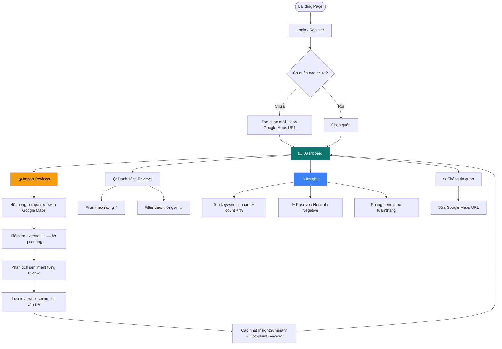
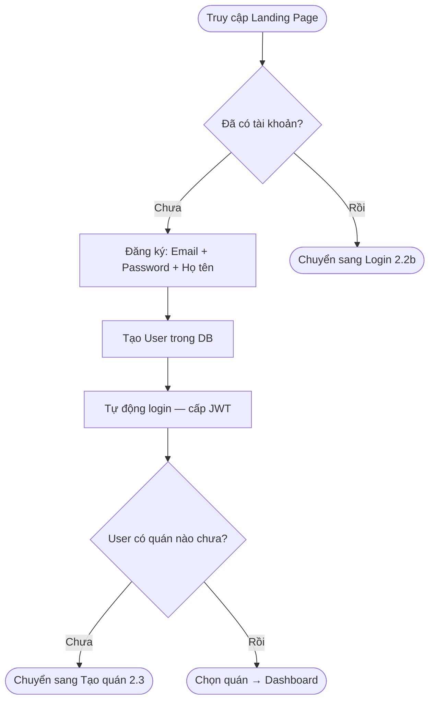
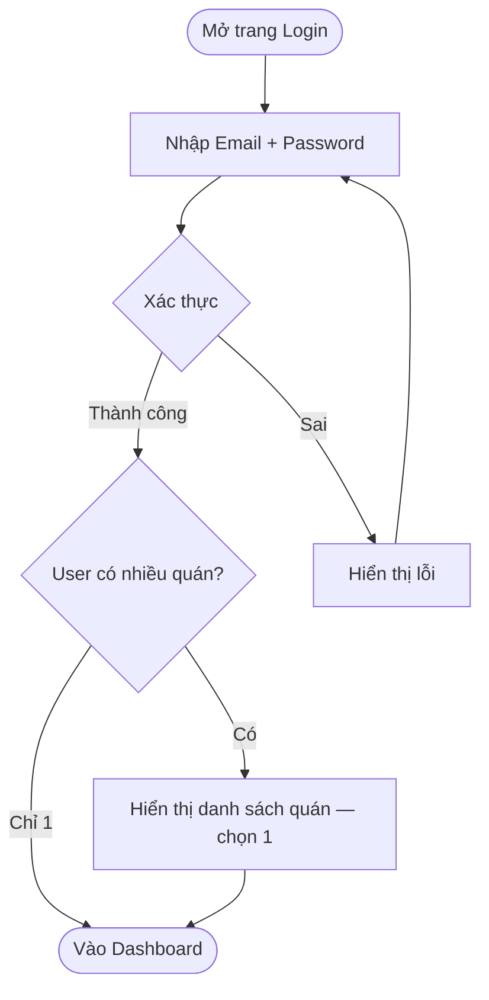
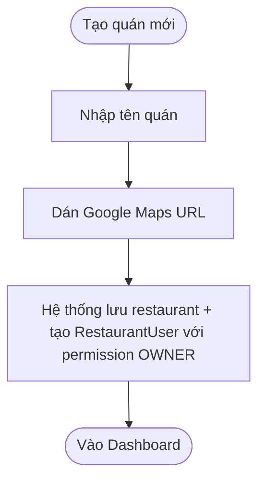
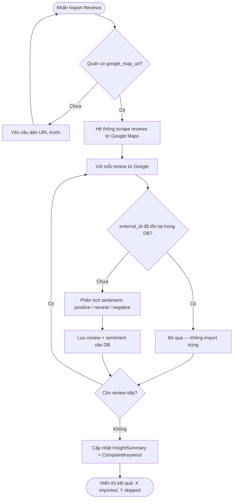
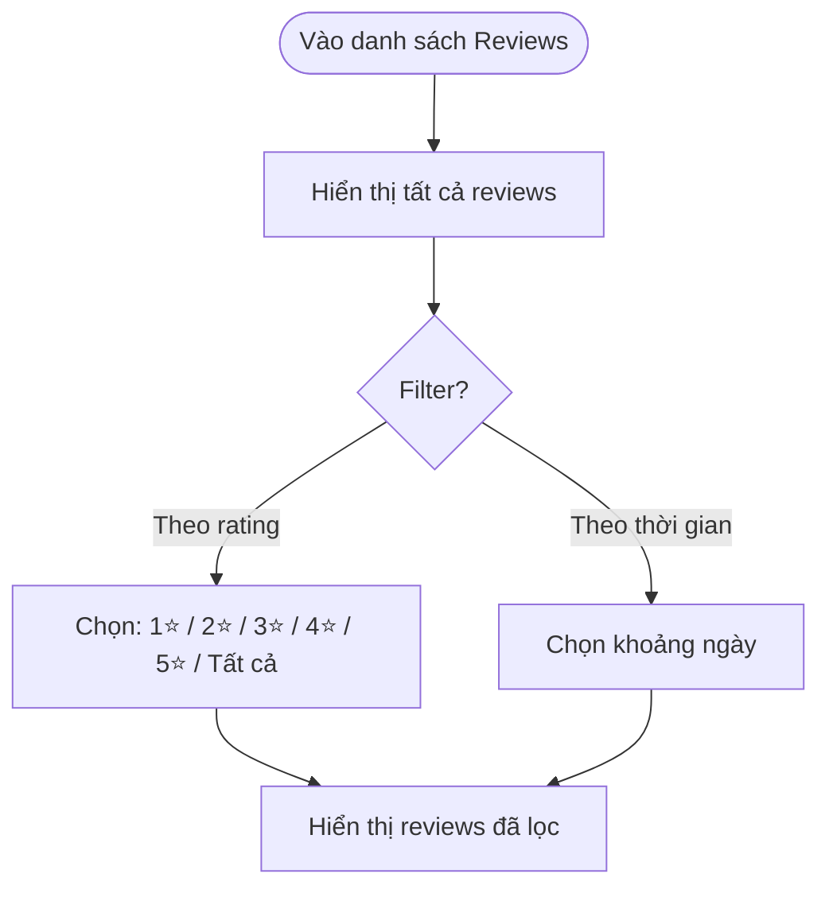

# 2. User Flow Diagram — Sprint 1

Date: 2026-03-02
Updated: 2026-03-05

Scope: **Sprint 1 MVP only** — Authentication, Restaurant Management, Google Review Import, Dashboard, Insights.

---

## 2.1 Master Flow (Sprint 1)



---

## 2.2 Registration Flow



---

## 2.2b Login Flow



---

## 2.3 Restaurant Setup Flow



---

## 2.4 Review Import Flow



---

## 2.5 Dashboard View Flow

```mermaid
flowchart TD
    A([Vào Dashboard]) --> B[Xem KPI Cards]
    B --> C[Tổng reviews | Avg Rating | % Positive | % Negative]

    A --> D[Xem Sentiment Breakdown]
    D --> E[Pie chart: Positive / Neutral / Negative]

    A --> F[Xem Trend Chart]
    F --> G{Đổi period?}
    G -->|Có| H[Chọn: Tuần / Tháng]
    H --> F

    A --> I[Xem Top Complaint Keywords]
    I --> J[keyword + count + % so tổng review tiêu cực]

    A --> K([Xem danh sách Reviews])
    A --> L([Import thêm Reviews])
```

---

## 2.6 Review List & Filter Flow



---

## 2.7 Database Entity Map (Sprint 1)

| Entity | Mục đích | Liên quan feature |
|--------|----------|-------------------|
| `User` | Tài khoản đăng nhập | A. Auth |
| `Restaurant` | Thông tin quán + google_map_url | B. Restaurant |
| `RestaurantUser` | User ↔ Restaurant (OWNER/MANAGER) | B. Restaurant |
| `Review` | Review đã import + sentiment | C. Import, D. Dashboard |
| `InsightSummary` | Cache KPI (avg rating, % pos/neg, total) | F. Sentiment |
| `ComplaintKeyword` | Top keywords tiêu cực | E. Complaint |

---

## 2.8 Không nằm trong Sprint 1

Các flow sau **không triển khai** trong Sprint 1:

- ❌ Email verification
- ❌ Forgot password
- ❌ Plan selection / Payment
- ❌ Invite member
- ❌ CSV upload
- ❌ Report generation / Export PDF
- ❌ Multi-platform (Facebook, Shopee)
- ❌ Notification / Alert
